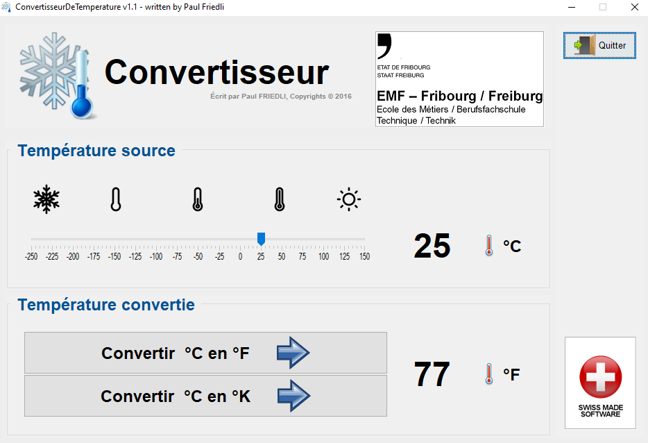
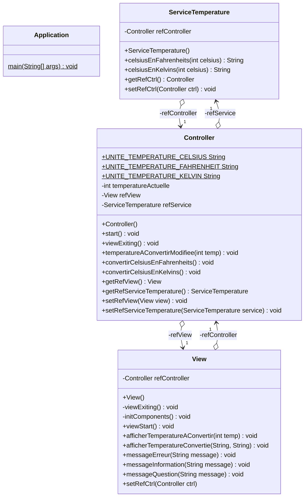
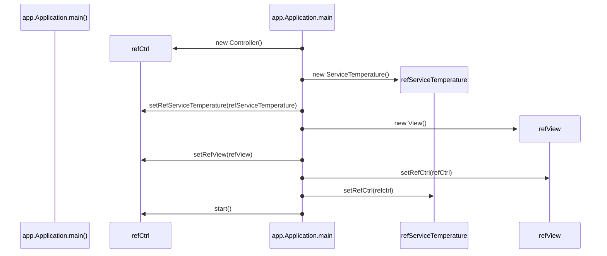

# Exercice 07 : Convertisseur de température
## Durée : 120'
## Objectifs visés :
Comprendre MVC ; Maitriser les diagrammes de séquence ; Maitriser les diagrammes de classes ; Se référer à la Javadoc.

## Travail à réaliser
Lisez avec attention les informations fournies ci-après sous diverses formes (diagramme de classe, javadoc, diagrammes de séquence, …) car vous y trouverez toutes les informations utiles afin de finaliser le projet Java « **ConvertisseurTemperature** ».

## Résultat à obtenir
Si votre code est correctement implémenté selon les directives reçues, vous devriez obtenir une application fonctionnelle ressemblant à cela :  

### Diagramme de classes

### Structure des packages Java
Voici la structure des packages pour chaque classe du projet

### Diagramme de séquence
Voici le diagramme de séquence de la méthode de la méthode `main()` de la classe `Application` du package `app` :

### Javadoc
La Javadoc se trouve directement dans les classes Java. Il ne vous reste plus qu'à remplacer les commentaires `// VOTRE CODE ICI...`
